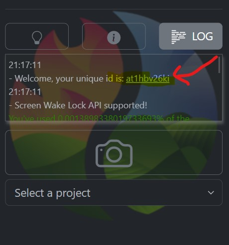

## Introduction

An app to automatically snap geotagged and oriented photoes from your
smartphone upload them to a remote repository for structured storage.

[GO TO APP](https://www.cirgeo.unipd.it/fireres/index.html)

Users must be registered for the image to be accepted. Each image must
be associated to a project by selecting the project from the drop down
menu. The objective is crowd-sourcing information related to fuel
models.

More information in the "description" section.

## Funding

This work is funded from the project [***FIRE-RES, Innovative
technologies & socio-ecological-economic solutions for fire resilient
territories in Europe***](https://fire-res.eu/) under the European
Horizon 2020 research and innovation programme under grant agreement No
101037419

[{width="600"}](https://fire-res.eu/)

## Description

Differences with other crowd-collected data apps:

-   it is quite cross-platform, just requires a browser (tesed on Chrome
    and Firefox) thus works on PCs, smartphones, tablets etc...

-   easy to install; installing allows you to load the app also without
    internet connection - just go to the browser menu and select
    "install app"

-   does not require to install with Google Play or APK files

-   ***works offline***: images are stored locally if no internet
    connection is available. As soon as internet connection becomes
    available, they are synced to the remote storage facility.

-   everything is stored in the image file using [EXIF
    tag](https://exiftool.org/TagNames/EXIF.html) "ImageDescription"
    thus information is not distributed across multiple files.

    -   data is saved as strings separated by pipe character ('\|'),
        ordere as:
        -   'project',

        -   'longitude',

        -   'latitude',

        -    'azimuth',

        -   'zenith',

        -   'timestamp',

        -   'accuracy',

        -   'uid'.

For example [download the image
HERE](20230325_100223.jpg){target="_blank" download="1"} and right click
in your PC over the downloaded file and select "properties". In the
image properties go to "details" and you will see the EXIF information
below:

FIRELinks\|9.2174032\|44.3598822\|358\|86\|1679734943295\|3\|q7p1w0a1nk

## Installation

Users can directly access the app using their browser (Chrome browser is
strongly encouraged) via <https://www.cirgeo.unipd.it/fireres> .

To access the app offline, the user must install the app in their phone.

They can do that directly from their browser by clicking "Install app"
banner that pops from the top or bottom of the browser window (see left image below) or, if this banner does not appear, just go to the top right menu and select
"install app" (see right image below). 

This will add an icon to your smartphone where you can directly open the
app also if you are not online.

 

## Usage

User can snap photos the APP will double-check that they are GeoTagged
correctly and provide alerts in case your camera is not enabled to
geotag images.

*The photo will be uploaded to the server if there is internet
connection, otherwise it will be cached and synced the next time that
the APP is started and internet connection is detected.*

1.  tap the photo icon to go to capture mode and start streaming from
    your camera; you will see two square spaces over a red background:
    
    - **(A)** top rectangle (or left if smartphone is held horizontally)  
    shows an area with the video stream of your camera. On top are 
    coordinates and accuracy (A) and azimuth and elevation angle.s
    
    - **(B)** bottom rectangle (or right if smartphone is held horizontally)
    is striped  until the user taps on the video -- (see images below);
    
    
If user   taps the video a screenshot is saved in area (B) also with 
current coordinates and orientation of when you tap the video -- see second
image from left below.  If user taps the screenshot in image area (B), the 
image is sent to server (see third image from left below).

**If there is no internet connection, it is not a problem, 
you can tap the screenshot and your photo will be saved and synced later**

Below are the warning messages that appear 
if you become offline and when you come back online. All messages are also
visible in the log panel.

  
2.  to **exit** the capture mode tap the red background area or the striped 
empty screenshot space (B)

## Mapped photoes

An interactive portal is available to check your photoes georeferenced
on a map. [OPEN PORTAL
HERE](https://www.cirgeo.unipd.it/fireres/incoming/index.html){target="_blank"}.

**NB: your photoes will be stored and viewed only if you validate your
email** by opening the log panel and clicking over your unique user id
(UID). This will open your email app and you just have to send the email
to the provided address with the automatic subject.

{width="260"}

If you do not have an email active in your smartphone or you want to
send the validation request on a different email address, you can just
send a normal email from anywhere with the following string as subject:
**geocatchappid-\<yourUID\>** where *\<yourUID\>* is your user id. For
example if your app is like the one in the image above, send an email
with the following subject:

geocatchappid-at1hbv26ki
